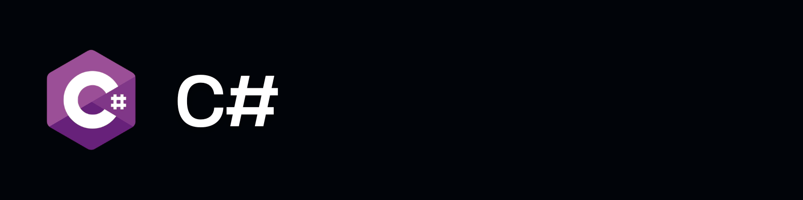

  

# Sobre Mim
Olá! Me chamo **Amanda Veras** 👋  
Sou estudante da área de **Desenvolvimento de Sistemas**, com foco em programação, lógica e construção de projetos práticos.

🎓 Formação técnica com experiência em:
- Desenvolvimento Web
- Programação Orientada a Objetos
- Banco de Dados
- Eletrônica e Arduino (Projetos no Tinkercad)

🚀 Atualmente focada em:
- Evoluir como desenvolvedora Backend
- Criar projetos práticos e funcionais
- Aprimorar boas práticas e arquitetura de código
  
# Ferramentas Utilizadas

  
  

   

  
  
  

   

  
  
  

   

  
  
  

   

  
  
  

   

  
  
  

  

